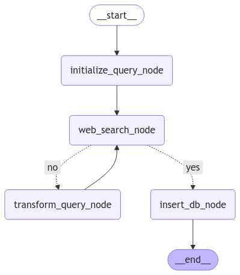
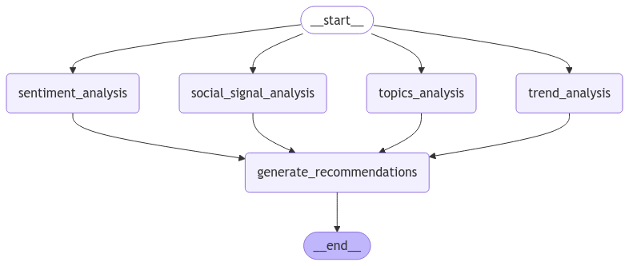
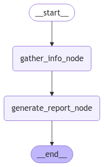

# brandAnalysis
Performs brand analysis using LLMs and LangGraph

# Background

Social perceptions are very important for every brand to market successfully. And with LLM agent technologies, this can be easily achieved.

Social perceptions for a brand consists of the following components:
- Trendy topics among target audience
- Social signals
    - Likes
    - Shares
    - Views
    - Comments
    - Click-through rates (CTR) 
    - Number of followers
    - Brand mentions
    - Influencer engagement
- Insights: Like/Dislike ratio, audience bahavior, hot topics among audience

Information about the brand can be collected from web scraping, and then are stored in vector databases.

On top of the collected data, we may perform:
- non-agentic data analysis:
    - identify key trends
    - summarize social signals
    - store research results in a vector database
- agentic part:
    - Leverage LLMs to interpret and summarize the data
    - Explore actionable opportunities through LLM reasoning

Then, we orchestrate agents to perform the web research, analysis, and final report generation.

# Installation
Install Python

Install packages for the project

- Easy setup:
```bash
pip install -r requirements.txt
```

- Or Virtual Environment setup:
```bash
python -m venv /path-to-venv-directory/
source /path/to/.venv/bin/activate
pip install -r requirements.txt
```

Configure API keys:
* Note: This app assumes you have access to OpenAI API, Tavily API, and LangChain API
* Find your API keys for the aforementioned APIs and populate them in a `.env` file.
* `.env` format is specified in `.env.example`

Customize app
* You may customize behavior of the agents by modifying the `config.py` file

# How to use
```bash
python main.py
```

# Design

## Original Vision
- Use a RAG flow to determine how much data is crawled
- Use map-reduce summarization agent for trends and social signals. 
- Build a chain of thought, reflection agent to generate recommendations
- store state into PGVector
- build a frontend
- bonus: integrate reddit API, and other search engines. build in more visualization in final report. Q & A after generating the report

## Current Design

### High level concepts
Introducing the agents:

Researcher agent: Takes the brand name as input, performs web search in a loop. We have a condition for scoring the relevance of information, and then a node for adjusting the search query. This agent loops until satisfying data is collected, then stores the data into the vector database with metadata (date, source etc.) and are labeled "fact" in a special attribute called "type"



Analysis agent: Takes "fact" entries in the database and performs analysis in a parallel fashion (depending on how many CPUs the host computer has). Consists of multiple analysis nodes, such as clustering algorithms, sentiment analysis, or simple summarization nodes, and will store the analysis results as entries in the vector database with the "type" attribute labeled as "derived"



Writer agent: will take a report template, then start querying the database for specific information (such as likes/dislike ratio, trendy topics among audience, 3 most discussed topics relating to the brand).



Final Report format:
- trends: social trends about the brand
- insights: audience behavior, preferences, sentiments (basically a summary of social signals). note: target audience may not only use your brand as their service
- recommendations: recommendations for the brand

### Implementation
- `main.py`: We define our parent agent in `main.py`. Then, we import our agents from the three files defining the agents.
- `prompts.py`: Prompt formats used by the agents are aggregated here
- `shared.py`: Shared objects such as LLM models, vector database and state are stored here
- `config.py`: Customization of agents
- `utils.py`: Useful tools you may use within the code, such as printing images for agent architecture

# Developer notes
- The workflow is probably the same for every brand. So, decision making mainly comes from the RAG data procured
- This is similar to an agentic data analytics solution
- if we need to count frequency of certain metrics for some insights, then LLMs are not well-suited and we need to use external tools

